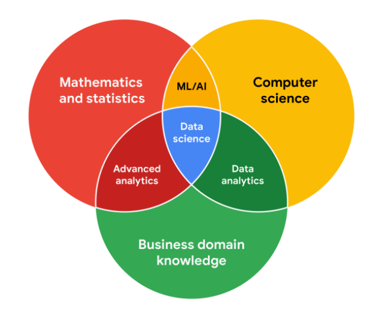

# Stakeholders
people that have invested time, interest, and resources into the projects

stakeholders' expectations are one of the most important
- kỳ vọng của stakeholders là một trong những điều quan trọng nhất.

## Executive team

The executive team provides strategic and operational leadership to the company. 
- They set goals, develop strategy, and make sure that strategy is executed effectively. 
- These stakeholders think about decisions at a very high level 
- they are looking for the headline news about your project first. 
- They are less interested in the details. 
- Time is very limited with them
    - leading your presentations with the answers to their questions.
    - You can keep the more detailed information handy in your presentation appendix or your project documentation for them to dig into when they have more time. 

## Customer-facing team

The customer-facing team includes anyone in an organization who has some level of interaction with customers and potential customers.
- Typically they compile information, set expectations, and communicate customer feedback to other parts of the internal organization.
    - Thông thường, họ tổng hợp thông tin, đặt kỳ vọng và truyền đạt phản hồi của khách hàng tới các bộ phận khác của tổ chức nội bộ.
- These stakeholders have their own objectives and may come to you with specific asks.
- It is important to let the data tell the story and not be swayed by asks from your stakeholders to find certain patterns that might not exist. 

## Data science team

Organizing data within a company takes teamwork.

# Working effectively with stakeholders

## Discuss goals

Stakeholder requests are often tied to a bigger project or goal.
- Khi họ yêu cầu bạn điều gì đó, hãy tận dụng cơ hội để tìm hiểu thêm.
- Ask about the <ins underline>KIND</ins> of results the stakeholder wants.
- Sometimes, a quick chat about goals can help set expectations and plan the next steps.

## Feel empowered to say “no.”

Stakeholders don’t always realize the time and effort that goes into collecting and analyzing data.
- They also might not know what they actually need.
- You can help stakeholders by asking about their goals and determining whether you can deliver what they need. 

If you can’t, have the confidence to say “no,” and provide a respectful explanation.
- If there’s an option that would be more helpful, point the stakeholder toward those resources. 
- If you find that you need to prioritize other projects first, discuss what you can prioritize and when.
-  When your stakeholders understand what needs to be done and what can be accomplished in a given timeline, they will usually be comfortable resetting their expectations.

## Plan for the unexpected.

Before you start a project, make a list of potential roadblocks. 

## Know your project.

Keep track of your discussions about the project over email or reports, and be ready to answer questions about how certain aspects are important for your organization. 

## Start with words and visuals.

Start with a description and a quick visual of what you are trying to convey.
- bắt đầu với mô tả và hình ảnh nhanh về những gì bạn đang cố gắng truyền đạt.
- The faster everyone agrees, the faster you can perform the first analysis to 
    - test the usefulness of the project, 
    - measure the feedback, 
    - learn from the data,
    - implement changes.

## Communicate often

Your stakeholders will want regular updates on your projects.
- Share notes about project milestones, setbacks, and changes.

# Focus on what matters

1. Who are the primary and secondary stakeholders?
    - Primary là những người có quyền cao nhất trong project
        - Nội bộ team
        - Executive team

1. Who is managing the data?

1. Where can you go for help?
    - Nếu có khó khăn thì phải biết chỗ để nhờ
    - Giảm thiểu thời gian + tài nguyên

## Vice president of sales: Phó giảm đốc Sales

The VP of sales provides strategic and operational direction but is less interested in specific details. 
- Prepares questions ahead of time to focus on the key findings that the company expects from an annual sales report.

## Sales team

Members of the sales team have direct interactions with customers and are highly attuned to how the company performed over the past year. 
- They can provide detailed information on the types of data that will matter most to the company’s customers.

## Data analytics team

The data analysts each have a dataset that they focus on and can help pull the various types of data that needs to satisfy the other stakeholders. 
- Collaborates with them to complete the report.

## Data science managers

The data science managers oversee all of the company’s datasets and can help prioritize the types of data and analyses required for the annual report. 
- They can also advise on making an effective presentation.
