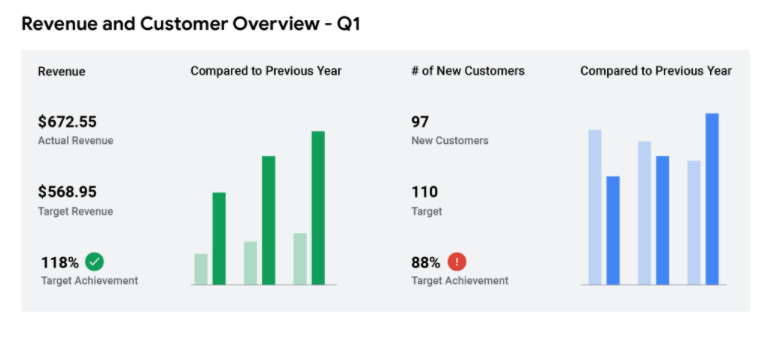
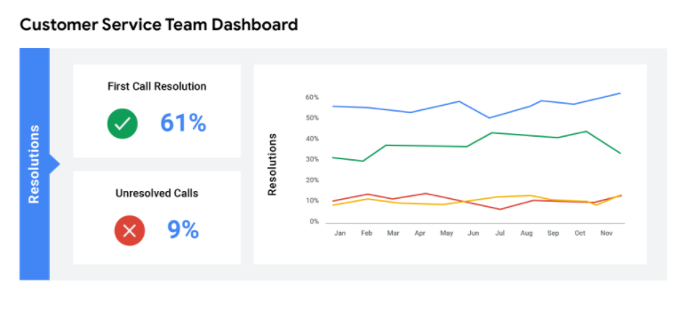
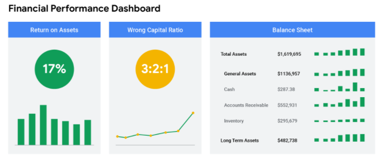

<style>
[tooltip] {
    position: relative;
    padding-bottom: 0.25px;
    border-bottom: solid 1px;
    text-decoration: none;
}

[tooltip]::before {
    display: none;
    content: attr(title);
    background-color: #6fa2fa;
    justify-content: center;
    border-radius: 3px;
    width: max-content;
    position: absolute;
    bottom: 100%;
    left: 50%;
    transform: translateX(-50%);
    text-align: center;
    padding: 0.25rem;
    max-width: 160px;
    word-break: keep-all;
    font-size: 0.75rem;
}

[tooltip]:hover::before {
    display: block;
}

[underline] {
    padding-bottom: 0.25rem;
    border-bottom: solid 1px;
    text-decoration: none;
}
</style>

# Data communicate
Data is great, but if we can't communicate the story data is telling, it isn't useful to anyone
- Data dù tốt nhưng member không hiểu cùng 1 hướng về data thì cũng không hữu dụng
- Phải cùng clear mindset cho nhau về việc data đang nói về cái gì

➞ Sử dụng data presentation tools = 1 cầu nối để truyền đạt định hướng của data cho tất cả mọi người
## Data presentation tools
- Report
    - A static collection of data given to stakeholders <ins tooltip title="định kì">periodically</ins>.
    - Pros
        - high level historical data for an organization.
        - Easy to design
        - data is already cleaned + already sorted
            - Insight khác nhau với mỗi thời điểm
    - Cons
        - Continual maintenance
            - Phát triển liên tục, không tự động
        - Less visually appealing
            - không hấp dẫn về mặt hình ảnh
        - Static data = data not changed
- Dashboard
    - monitors live, incoming data.
    - Pros
        - dynamic: long-term value
            - Có thể nhìn dưới nhiều góc độ, nhiều hệ quy chiếu khác nhau
        - automatic: more access to information being recorded
        - interactive: interact through data by playing with filters
        - More stakeholder access
        - Low maintenance
            - Không cần định kì
            - Khi nào lỗi (sai, lỗi thời) mới phải sửa
        - Nice to look
    - Cons
        - labor-intensive design
            - thiết kế sử dụng nhiều lao động
            -  take a lot of time to design
            - If the base table breaks at any point
                - they need a lot of maintenance to get back up and running again.
        - Can be <ins tooltip title="gây nhầm lẫn">confusing</ins>
            - less <ins tooltip title="hiệu quả">efficient</ins> than reports
        - <ins tooltip title="tiềm năng">Potentially</ins> uncleaned data
            - Data có tiền năng unclean
            - áp đảo mọi người với thông tin quá

Data analyst need to decide the best way to communicate information to your stakeholders
- Để clean mong muốn stakeholders ➞ làm rõ mục tiêu của project ➞ tìm ra phương hướng đúng cho project

## Pivot table: bảng tổng hợp
- a data summarization tool that is used in data processing.
- Pivot tables are used interact data stored in a database
    - summarize
    - sort
    - re-organize
    - group
    - count
    - total
    - average
- Transform `row ⇆ column`

# Metric
a single, quantifiable type of data that can be used for measurement.
    - A metric is a single, quantifiable type of data used when setting and evaluating goals.
- 1 loại data định lượng chuyên dùng để đo lường
- Data is a collection of facts ➞ Metrics are quantifiable data types used for measurement.
    - Metrics = tập con của Data
- Data starts: raw fact ➞ organize ➞ <ins tooltip title="duy nhát, riêng">individual</ins> metrics ➞ represent a single type of data
- Metrics ➞ combined ➞  <ins tooltip title="công thức, phép tính">formula</ins>s that you can plug your numerical data into
    - Từ metric có thể suy luận ra 1 công thức để áp dụng vào các numerical data khác
- Data contains a lot of raw details about the problem we're exploring. 
    - But we need the right metrics to get the answers we're looking for.

Return on <ins tooltip title="Khoản đầu tư">Investment</ins> (ROI): 
- Formula designed using metrics that let a business know how well an investment is doing.
```ts
    type ROI = Fomula<(investment: any) => Efficient>
                Metric<Profit>
                = ------------------------
                Metric<CostOfInvestment>
```

metric goal 
    - a measurable goal set by a company and evaluated using metrics.
    - Là goal có thể đo lường (numerical) + đạt được bằng metric

# Beauty of dashboards

## Benefits of Dashboards
<table>
    <tr>
        <th>
            Benefits
        </th>
        <th>
            For data analysts
        </th>
        <th>
            For stakeholders
        </th>
    </tr>
    <tr>
        <td>
            <ins tooltip title="Tập trung hóa">Centralization</ins>
        </td>
        <td>
            Sharing a single source of data with all stakeholders
        </td>
        <td>
            Working with a <ins tooltip title="Toàn diện">comprehensive</ins> view of data
            <br /> - initiative: sáng kiến
            <br /> - objectives: mục tiêu
            <br /> - projects
            <br /> - processes
            <br /> - so on
        </td>
    </tr>
    <tr>
        <td>
            <ins tooltip title="sự hình dung, sự mường tượng">Visualization</ins>
        </td>
        <td>
            Showing and updating live, incoming data in real time
        </td>
        <td>
            <ins tooltip title="Nhận ra">Spot</ins>ting changing trends and patterns more quickly
        </td>
    </tr>
    <tr>
        <td>
            <ins tooltip title="Sự sâu sắc">Insightfulness</ins>
        </td>
        <td>
            Pulling relevant information from different datasets
        </td>
        <td>
            Understanding the story behind the numbers to keep track of goals and make data-driven decisions
        </td>
    </tr>
    <tr>
        <td>
            <ins tooltip title="Sự tùy biến">Customization</ins>
        </td>
        <td>
            Creating custom views dedicated to a specific person, project, or presentation of the data
        </td>
        <td>
            Drilling down to more specific areas of specialized interest or concern
        </td>
    </tr>
</table>

## Creating a dashboard
1. Identify the stakeholders who need to see the data and how they will use it
    - To get started with this, you need to ask effective questions.
    1. Ask users (or set yourself as the user)
        1. How do you hope data will help you?
        1. What questions are you trying to answer with the data? 
            - In other words, what problem are you trying to solve?
        1. What are the three most important metrics that you care about?
        1. How are these metrics defined or calculated?
        1. Will you need to limit the data you see 
            - for example, will you need to only look at results from a specific region or a specific time frame? 
            - How so?: Thực hiện điều đó như thế nào?
        1. Are all the data sources you need to answer your questions currently available?
        1. Are there any reports you use today that could be provided as examples of what would be useful? 
            - If so, please provide them.
            - Dùng report để thử nghiệm requirement dành cho dashboard
        1. If you had all this information in front of you, would you have enough information to take action? 
            - What action would you take? 
            - Would you need to know anything else?
    1. Business Requirements Summary
        - Use this section to summarize your findings from user interviews.
        1. <ins underline>Who</ins>
            1. Who is the target audience for this dashboard?
            1. Primary Business Owner?
            1. Primary Technical Owner?
        1. <ins underline>What</ins>
            1. What is the <ins tooltip title="điểm đau của khách hàng">pain point</ins> this dashboard aims to address?
                - Đâu là điểm đau của khách mà dashboard sẽ giải quyết?
            1. What requirements have been expressed for this content? 
                - Yêu cầu cho solition của pain point là gì?
            1. What actions are the users trying to take based on this data?
    1. Technical Requirements Summary
        1. <ins underline>What</ins>
            - Do you have examples of existing reports that should be replicated?
            - Do you have product specifications, or requirements for what metrics you need? 
            - Will having this data in Looker replace an existing system?
        1. <ins underline>Where</ins> (Data enginer)
            - Is the data needed for this dashboard readily available?
            - Which data sources <ins tooltip title="tương quan">correlate</ins> to this dashboard? 
                - Tránh sự lặp lại không cần thiết
            - Where does this data live?
            - What is the delivery method for this data? 
        1. <ins underline>Who</ins>
            - Who should have access to this data?
            - Who should not have access to this data?
1. Design the dashboard (what should be displayed)
    - tips
        - Use a clear header to label the information
        - Add short text descriptions to each visualization
        - Show the most important information at the top
1. Create mock-ups (optional)
1. Select the visualizations you will use on the dashboard
1. Create filters as needed

## Types of dashboards

### Strategic dashboards: Dashboard chiến lược
Focuses on long term goals and strategies at the highest level of metrics
- So sánh <ins underline>current facts</ins> VS <ins underline>strategic target</ins>
- Wide range of businesses use strategic dashboards
    - when evaluating and aligning their strategic goal
    - đánh giá và điều chỉnh mục tiêu chiến lược
- These dashboards provide information over the longest time frame
    - from a single financial quarter to years



### Operational dashboards

Contain information on a time scale of days, weeks, or months
- they can provide performance insight almost in real-time. 
- the most common type of dashboard

This allows businesses to track and maintain their immediate operational processes in light of their strategic goals. 



### Analytical dashboards

Analytic dashboards contain a vast amount of data used by data analysts. 
- These dashboards contain the details involved in the usage, analysis, and predictions made by data scientists. 

Certainly the most technical category, analytic dashboards are usually created and maintained by data science teams and rarely shared with upper management as they can be very difficult to understand. 
- Có thêm những thông số kĩ thuật: độ sai số, ... để phục vụ cho quá trình phân tích


