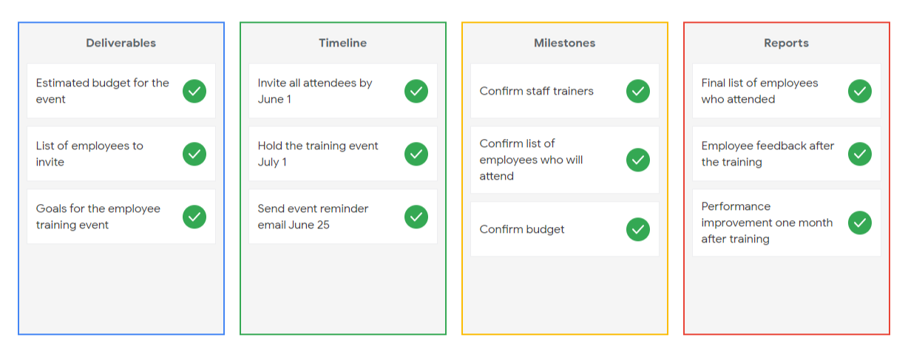
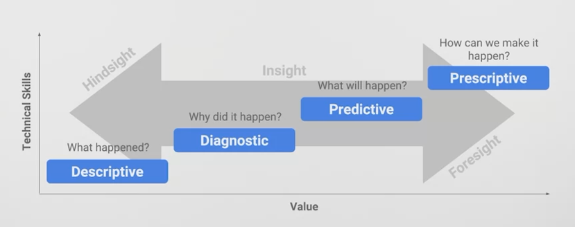

# Problem domain
the specific area of analysis that encompasses every activity affecting or affected by the problem
- Khu vực cần phân tích vì
    - Có ảnh hưởng tới solution
    - Chịu ảnh hưởng bởi problem

Structured thinking
1. Recognizing the current problem or situation
1. Organizing available information 
1. Revealing gaps and opportunities
1. Identifying your options

# Scope of Work (SOW) 
an agreed-upon outline of the work you're going to perform on a project.
- một phác thảo đã được thống nhất về công việc bạn sẽ thực hiện trong một dự án.

1. Deliverables
    - Deliverables are items or tasks you will complete before you can finish the project.
        1. What work is being done?
        1. What things are being created as a result of this project?
        1. When the project is complete, what are you expected to deliver to the stakeholders? 
        1. Will you collect data for this project? How much, or for how long? 
    - Items or tasks cần hoàn thành khi finish the project
    - Kết quả của project là gì.
    - Avoid vague statements.
        - Tránh đề xuất kết quả mơ hồ
        - Use numbers and aim for hard, measurable goals and objectives.
    
1. Milestones
    - Milestones are significant tasks you will confirm along your timeline to help everyone know the project is on track.
    - Significant tasks quan trọng trong timeline cần phải có.
    - Mục tiêu của project
    - This is closely related to your timeline.
        - What are the major milestones for progress in your project?
        - How do you know when a given part of the project is considered complete?
            - Khi tạo ra một milestones thì phải đi kèm với điều kiện để đánh giá hoàn thành milestore
        - Milestones can be identified 
            - by you
            - by stakeholders
            - by other team members such as the Project Manager.

1. Timeline
    - Timelines include due dates for when deliverables, milestones, and/or reports are due.
    - Plan cho 3+ cái còn lại: deliverables, milestones, reports, ...
    - The timeline is a way of mapping `expectations` ⇄ `how long each step of the process should take`.
    - The timeline should be specific enough to help all involved decide if a project is on schedule.
        - When will the deliverables be completed?
        - How long do you expect the project will take to complete?
        - If all goes as planned, how long do you expect each component of the project will take? 
        - When can we expect to reach each milestone?

1. Reports
    - Reports notify everyone as you finalize deliverables and meet milestones.
    - Reports là bằng chứng cho thấy deliverables thỏa mãn milestones.
    - Good SOWs also set boundaries for how and when you’ll give status updates to stakeholders
        - Sẽ là 
        - How will you communicate progress with stakeholders and sponsors, and how often?
        - Will progress be reported weekly? Monthly? 
        - When milestones are completed? What information will status reports contain?

## Statement of Work VS Scope of Work
Try not to confuse Statement of Work VS Scope of Work
- Which are both abbreviated as SOW.
- Although they both are used to define 
    - deliverables
    - timeline
- they aren't the same and shouldn't be used <ins tooltip title="thay thế cho nhau">interchangeably</ins>.

A statement of work
- a document that clearly identifies the products and services a vendor or contractor will provide to an organization.
    - Document xác định rõ ràng các sản phẩm và dịch vụ mà một nhà cung cấp hoặc nhà thầu sẽ cung cấp cho một tổ chức.
    - Bảng dịch vụ của nhà thầu chứ không phải nội bộ
- It includes 
    - objectives
    - guidelines
    - deliverables
    - schedule
    - costs

A scope of work
- project-based and sets the expectations and boundaries of a project.
    - Tổng quan cho cả dự án = statement of work + internal
- Included in a statement of work to help define project outcomes.

As a junior data analyst, It's more typical to be asked to create a scope of work than a statement of work.

## Why do you need an SOW?

The point of data analysis projects is to complete business tasks that are useful to the stakeholders.
- SOW helps to make sure that everyone <ins tooltip title="tham gia">involve</ins>d
- Shares the understanding of what those business goals
- The plan for accomplishing those business goals.
- SOW dùng để xác định những người tham gia + tasks của họ + plan để hoàn thành those business goals.

## What is in and out of scope?

SOWs should also contain information specific to what is and isn’t considered part of the project.
- Xác định được thứ sẽ PHẢI hoàn thành + KHÔNG CẦN hoàn thành

# Staying objective

importance of 
- contextualizing data: ngữ cảnh hóa dữ liệu
- recognizing data bias: nhận ra độ sai lệch của data

## Context: Ngữ cảnh
The <ins underline>condition</ins> in which something exists or happens.
- Actions can be <ins tooltip title="thích hợp">appropriate</ins> in some context, but inappropriate in others
- Context = condition cho action 
    - ➝ action chỉ thực hiện với context phù hợp
    - ➝ action không thực hiện với context không phù hợp
    - ➝ action có thể thực hiện được với context này mà không phù hợp với context khác

Numbers don't mean much without context. 

<ins tooltip title="sự ẩn dấu">hidesight</ins> ⇆ <ins tooltip title="tầm nhìn xa">foresight</ins>

1. Description: Mô tả context
    - What happend?
    - Data is descriptive
    - Show what is happen

1. Diagnostic: Chuẩn đoán context
    - Why did it happen?
    - Answering questions

1. Predictive: Dự đoán
    - What will happen?

1. Prescription: Cách thức hiện
    - How can we make it happen?

contextualizing data: ngữ cảnh hóa dữ liệu 
- Remain objective and recognize all sides of an argument, before drawing conclusions.
    - Giữ khách quan và nhìn nhận tất cả các mặt của một lập luận, trước khi đưa ra kết luận.
- Everyone approaches it in their own way
    - Ai cũng làm theo cách của mình

A data analyst asks who, what, when, where, why, and how in order to put information into context.
1. Who
    - Who collected the data?
1. What
    - What is it about? 
    - What does the data represent in the world?
1. How
    - How does it relate to other data?
    - How was it collected
1. When
    - When, was the data collected? 
    - Data collected a while ago may have certain limitations, given the present day situation.
1. Where
    - Where, was the data collected? 
1. Why
    - The why can have a particularly strong relationship with bias.

