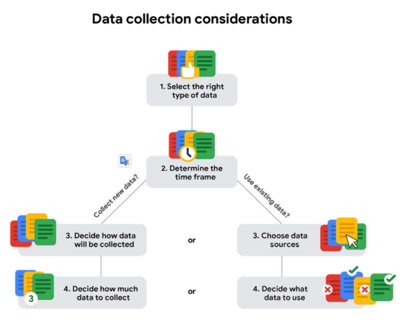
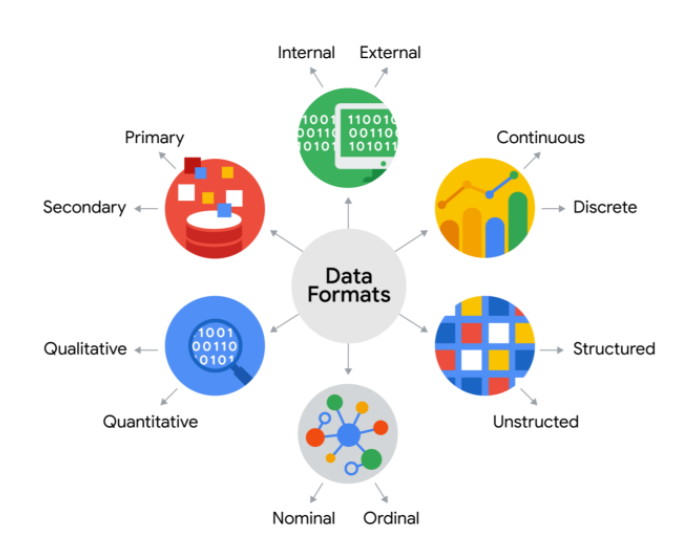
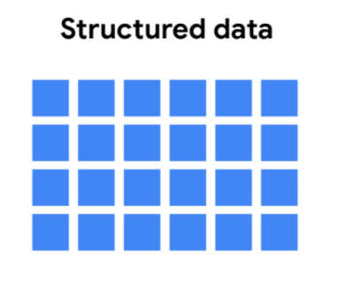
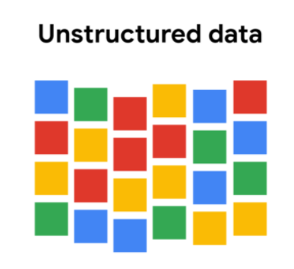

# Introduction

How data is generated

Different formats, types, and structures of data

Analyze data for bias and credibility

What "clean data" means

Databases

Extract data using spreadsheets and SQL

The basics of data organization

The process of protecting your data

# Data collection

## How data is collected

Interviews

Observations
- method of data-collection most often used by scientists.

Forms

Questions

Surveys

Cookies

# What data to collect

## Data collection considerations

1. ### Solving your business problem
    Datasets can show a lot of interesting information.
    -  But be sure to choose data that can actually help solve your problem question.

1. ### Select the right data type

1. ### Determine the time frame for data collection.

    If you are collecting your own data
    - Decide how long you will need to collect it, especially if you are tracking trends over a long period of time. 

    If you need an immediate answer
    - You might not have time to collect new data.
    - In this case, you would need to use historical data that already exists. 

1. ### How the data will be collected
    Decide if you will collect the data using your own resources or receive (and possibly purchase it) from another party. 
    - Data that you collect yourself is called first-party data.

1. ### How much data to collect

    Population 
    - Refers to all possible data values in a certain data set.

    Sample
    - A part of a population that is representative of the population.
    - In instances when collecting data from an entire population is challenging, data analysts may choose to use a sample.
    - Trong trường hợp khó thu thập dữ liệu từ toàn bộ dân số, các nhà phân tích dữ liệu có thể chọn sử dụng một mẫu.

1. ### Choose data sources

    First-party data
    - Data collected by an individual or group using their own resources.

    Second-party data
    - Data collected by which is data collected by a group directly from its audience and then sold.
    - Data mua từ một bên chuyên thu thập data

    Third-party data 
    - Data collected from outside sources who did not collect it directly.

1. ### Decide what data to use

# Data formats & Data structure

## Data Formats

### Primary & Secondary

|  | Primary Data | Secondary Data |
|---|---|---|
| Defination | - Collected by a researcher from first-hand sources   - Data tự mình lấy hoặc mình tham gia lấy   - Data cứ do mình lấy, dù lấy từ bên ngoài | - Gathered by other people or from other research   - Data không phải do mình lấy   - Do người khác cùng team lấy |
| Example | - Data from an interview you conducted   - Data from a survey returned from 20 participants   - Data from questionnaires you got back from a group of workers | - Data you bought from a local data analytics firm’s customer profiles   - Demographic data collected by a university    - Census data gathered by the federal government |

### Internal & External

|  | Internal Data | External Data |
|---|---|---|
| Defination | - Data that lives inside a company’s own systems   - Data thuộc về công ty, dù mình lấy hay người khác lấy | - Data that lives outside of a company or organization   - External data is particularly valuable when an analysis depends on as many sources as possible.   - Lấy từ nguồn bên ngoài công ty |
| Example | - Wages of employees across different business units tracked by HR   - Sales data by store location   - Product inventory levels across distribution centers | - National average wages for the various positions throughout your organization   - Credit reports for customers of an auto dealership |

### Qualitative & Quantitative

|  | Qualitative Data (định tính) | Quantitative Data (định lượng) |
|---|---|---|
| Defination | - Subjective and explanatory measures of qualities and characteristics   - Can't be counted, measured, or easily expressed using number   - Usually listed as a name, category, or description. | - Specific and objective measures of numerical facts   - Can be measured or counted and then expressed as a number.   - This is data with a certain quantity, amount, or range. |
| Example | - Exercise activity most enjoyed   - Favorite brands of most loyal customers   - Fashion preferences of young adults | - Percentage of board certified doctors who are women   - Population of elephants in Africa   - Distance from Earth to Mars |

### Discrete & Continuous

|  | Discrete Data (rời rạc) | Continuous Data (liên tục) |
|---|---|---|
| Defination | - Data that is counted and has a limited number of values   - Quantitative data bị giới hạn về lựa chọn   - Số sao/số điểm/like/emotion   - Data định lượng là số tự nhiên   - Data định lượng là số thập phân nhưng có Max, Min + Limit số lượng số sau dấu chấm | - Data that is measured and can have almost any numeric value   - Data định lượng nhưng có thể bất kì 1 format nào (nên chọn 1 format)   - Data không có limit |
| Example | - Number of people who visit a hospital on a daily basis (10, 20, 200)   - Room’s maximum capacity allowed   - Tickets sold in the current month | - Height of kids in third grade classes (52.5 inches, 65.7 inches)   - Runtime markers in a video   - Temperature |

### Nominal & Ordinal

|  | Nominal Data (danh nghĩa) | Ordinal Data (thứ tự) |
|---|---|---|
| Defination | - A type of qualitative data that isn’t categorized with a set order   - Loại data định tính mà ko thể xếp loại (no sequence)   - Nhận bất kì giá trị nào | - A type of qualitative data with a set order or scale   - Loại data định tính mà Discrete |
| Example | - First time customer, returning customer, regular customer   - New job applicant, existing applicant, internal applicant   - New listing, reduced price listing, foreclosure | - Movie ratings (number of stars: 1 star, 2 stars, 3 stars)   - Ranked-choice voting selections (1st, 2nd, 3rd)   - Income level (low income, middle income, high income) |

### Structured & Unstructured

|  | Structured Data | Unstructured Data |
|---|---|---|
| Defination | - Data organized in a certain format, like rows and columns   - Organized in a certain format, such as rows and columns. | - Data that isn’t organized in any easily identifiable manner   - Not organized in any easy-to-identify way. |
| Example | - Expense reports   - Tax returns   - Store inventory | - Social media posts   - Emails   - Videos |
| Thumbnail |  |  |
|| Definded data types | Varied data types |
|| Most often quantitative data | Most often qualitative data
|| Easy to organize | Difficult to search
|| Easy to search | Provide more freedom for analysis
|| Easy to analysis | Stored in data lakes, data warehorses and noSQL databases |
|| Contained in rows and columns | Can't be put in rows and columns
|| Examples: Excel, Google Sheets, SQL, customer data, phone records, transaction history | Examples: Text messages, social media comments, phone call transcriptions, various log files, images, audio, video |
|| As we described earlier, structured data is organized in a certain format.   - This makes it easier to store and query for business needs.   - If the data is exported, the structure goes along with the data. | Unstructured data can’t be organized in any easily identifiable manner.   - And there is much more unstructured than structured data in the world.   - Video and audio files, text files, social media content, satellite imagery, presentations, PDF files, open-ended survey responses, and websites all qualify as types of unstructured data. |

## Data Structures

### Data type
A specific kind of data attribute that tells what kind of value the data is.
- Tells you what kind of data you're working with.

Data type in a spreadsheet 
- Number
- Text or string
- Boolean

Text or String data type
- A sequence of characters and punctuation that contains textual information.

Boolean data type 
- A data type with only two possible values: true or false

### Data Fields
Row     = Record

Column  = Field

Wide data
- Every data subject has a single row with multiple columns to hold the values of various attributes of the subject.
- Chỉ có một row , nhưng có RẤT NHIỀU COLUMNS 

Long data 
- Data in which each row is one time point per subject, so each subject will have data in multiple rows.
- \>= 1 cell trong row chưa value dùng lại nhiều lần (Directive Data || Ordinal Data)
    - Khi sort sẽ lặp value nhiều trên nhiều rows

| Wide data is preferred when | Long data is preferred when |
| --- | --- |
| Creating tables and charts with a few variables about each subject | Storing a lot of variables about each subject. For example, 60 years worth of interest rates for each bank |
| Comparing straightforward line graphs | Performing advanced statistical analysis or graphing |

# Transforming data

## Data Ttransformation Actions:

Adding, copying, or replicating data 

Deleting fields or records 

Standardizing the names of variables

Renaming, moving, or combining columns in a database

Joining one set of data with another

Saving a file in a different format. For example, saving a spreadsheet as a comma separated values (CSV) file.

## Why transform data?

Data **Organization**: Tổ chức Data
- Better organized data is easier to use

Data **Compatibility**: Tương thích Data
- Different applications or systems can then use the same data
- Data dùng chung cho nhiều systems

Data **Migration**: Di chuyển Data
- Data with matching formats can be moved from one system to another
- 2 systems có 2 data format || structure khác nhau
    - Để chuyển data từ systems A sang system B thì chuyển structure A sang structure B.

Data **Merging**: Hợp nhất Data
- Data with the same organization can be merged together
- Nhiều data source merge thành 1

Data **Enhancement**: Tăng cường Data
- Data can be displayed with more detailed fields
- Mở rộng Columns của data

Data **Comparison**: So sánh Data
- Apples-to-apples comparisons of the data can then be made
- Chuyển 2 data structures thành 1 để compare với nhau.
