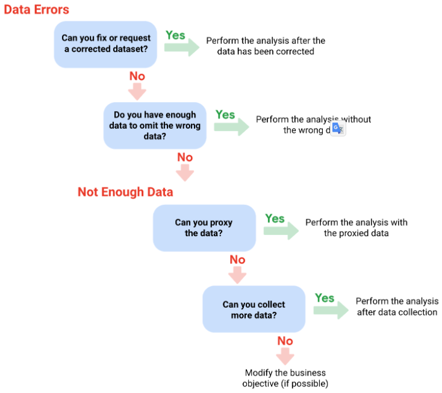

# Data integrity: Toàn vẹn dữ liệu

Data integrity is the accuracy (chính xác), completeness (toàn vẹn), consistency (nhất quán), and trustworthiness (đáng tin cậy) of data throughout its lifecycle.
- A strong analysis depends on the integrity of the data.

There's a chance data can be compromised every time it's 
- replicated: Sao chép
    - Data replication is the process of storing data in multiple locations
- transferred: Di chuyển
    - Data transfer, the process of copying data from a storage device to memory, or from one computer to another.
- manipulated: Thao túng
    - The data manipulation process involves changing the data to make it more organized and easier to read.

Other threads to data integrity
- Human error
- Viruses
- Malware: Phần mềm độc hại
- Hacking
- System failures

## Data constraints: ràng buộc về data

Để đảm bảo tính toàn vẹn, cần có ràng buộc trong quá trình clean data
- Để thống nhất giữa các data source
- Nếu có 1 data không thỏa mãn constraints ➝ this data is fail
    - Đừng xóa data fail mà nhặt riêng ra
    - Nhặt riêng fail data ra để phân tích (tìm hiểu nguyên nhân)

Data constraint | Definition | Examples
--- | --- | ---
Data type | Values must be of a certain type: date, number, percentage, Boolean, etc. | If the data type is a date, a single number like 30 would fail the constraint and be invalid
Data range | Values must fall between predefined maximum and minimum values | If the data range is 10-20, a value of 30 would fail the constraint and be invalid 
Mandatory (bặt buộc) | Values can’t be left blank or empty | If age is mandatory, that value must be filled in
Unique (Duy nhất) | Values can’t have a duplicate | Two people can’t have the same mobile phone number within the same service area
Regular expression (regex) patterns (Format data) | Values must match a prescribed pattern   Nếu lả date thì format date   Decimal thì phải thống nhất số thập phân   Data phải có format | A phone number must match ###-###-#### (no other characters allowed)
Cross-field validation (xác nhận chéo) | Certain conditions for multiple fields must be satisfied   Check chéo các fields = cách so sánh qua validate conditions | Values are percentages and values from multiple fields must add up to 100%
Primary-key | (Databases only) value must be unique per column | A database table can’t have two rows with the same primary key value. A primary key is an identifier in a database that references a column in which each value is unique. More information about primary and foreign keys is provided later in the program.
Set-membership (Giới hạn lựa chọn) | (Databases only) values for a column must come from a set of discrete values   Field là trắc nghiệm với các lựa chọn được xác định cụ thể | Value for a column must be set to Yes, No, or Not Applicable
Foreign-key | (Databases only) values for a column must be unique values coming from a column in another table | In a U.S. taxpayer database, the State column must be a valid state or territory with the set of acceptable values defined in a separate States table
Accuracy (chính xác) | The degree to which the data conforms to the actual entity being measured or described   Số liệu có phù hợp với thực tế không | If values for zip codes are validated by street location, the accuracy of the data goes up.
Completeness (đầy đủ) | The degree to which the data contains all desired components or measures   Data thỏa mãn đúng hệ quy chiếu đang sử dụng để đo | If data for personal profiles required hair and eye color, and both are collected, the data is complete.
Consistency (nhất quán) | The degree to which the data is repeatable from different points of entry or collection   Value có bị lặp lại trên nhiều cell | If a customer has the same address in the sales and repair databases, the data is consistent.

## Sample size

## Random sampling

## Testing data

# Clean Data

Verify and report your cleaning results.

## Well-aligned objectives and data

It's also important to check that the data you use aligns with the business objective. 

With incomplete data, it's hard to see the whole picture to get a real sense of what is going on.

Clean data + alignment to business objective = accurate conclusions

## Dealing with insufficient data: Xử lý không đủ dữ liệu

### Types of insufficient data

Data from only one source
- Bàn với stakeholder để bổ sung number of source

Data that keep updating

Outdated data
- Chỉ đúng cho một thời điểm

Geographically-limited data
- Chỉ đúng với một khu vực địa lý

### Ways to address insufficient data

Identify trends with the available data
- Coi data là đầy đủ và analysis nó

Wait for more data if time allows
- Đợi thêm data vào data set

Talk with stakeholders and adjust objective
- Nói chuyện với stakeholders để thay đổi plan + resource

Look for a new data set.
- Bỏ hết đi làm lại

### Issue with data

Proxy data: data từ 1 project tương tự
- Data nhân sự từ một công ty cùng ngành nghề + cùng số lượng nhân viên + cùng doanh thu

#### 1. No data

Gather the data on a small scale to perform a preliminary analysis and then request additional time to complete the analysis after you have collected more data. 
1. Thu thập data quy mô nhỏ để phân tích sơ bộ
2. Đợi thu thập thêm data
- Example:
    1. You are surveying employees about what they think about a new performance and bonus plan
    1. Use a sample for a preliminary analysis
    1. Then, ask for another 3 weeks to collect the data from all employees.

If there isn't time to collect data, perform the analysis using proxy data from other datasets. 
1. Không có thời gian để kiếm data phù hợp cho project
1. Kiếm data từ một project tương đương
- This is the most common workaround.
- Example: 
    1. If you are analyzing peak travel times for commuters
    1. Don’t have the data for a particular city, 
    1. Use the data from another city with a similar size and demographic. 

### 2. Too little data

Do the analysis using proxy data along with actual data.
- Phân tích kết hợp data tìm được + data tương tự 
- Example:
    1. You are analyzing trends for owners of golden retrievers
    1. Make your dataset larger by including the data from owners of labradors.

Adjust your analysis to align with the data you already have.
- Chỉ phân tích dự trên những data tìm được
- Example:
    1. You are missing data for 18- to 24-year-olds
    1. Do the analysis  
    1. Note the following limitation in your report: this conclusion applies to adults 25 years and older only.

### 3. Ưrong data, including data with errors

Sometimes data with errors can be a warning sign that the data isn’t reliable.
- Data bị nhập sai
- Use the best judgment.

If data is wrong because requirements were misunderstood, communicate the requirements again.
- **Sai do hiểu sai requirements**
- Example: 
    1. You need the data for female voters
    1. Received the data for male voters
    1. Restate your needs.

Identify errors in the data and, if possible, correct them at the source by looking for a pattern in the errors.
1. Phát hiện data is error
1. Vẫn giữ nguyên error data
1. Đổi format | cách hiểu vấn đề | hệ quy chiếu | pattern để biến data thành correct
- Example: 
    1. If data is in a spreadsheet
    1. There is a conditional statement or boolean causing calculations to be wrong
    1. Change the conditional statement instead of just fixing the calculated values.

If you can’t correct data errors yourself, you can ignore the wrong data and go ahead with the analysis if your sample size is still large enough and ignoring the data won’t cause systematic bias. 
1. Phát hiện error data
1. Không thể sửa được data
1. Error data rất nhỏ so với tổng thể
1. Error data không guây sai lệnh cho system
1. Bỏ data những error data này
1. Tiếp tục analysis
- Example: 
    1. Dataset was translated from a different language
    1. Some of the translations don’t make sense
    1. Ignore the data with bad translation
    1. Go ahead with the analysis of the other data.

# Sample size

Part of a population that's representative of the population.

The goal is to get enough information from a small group within a population to make predictions or conclusions about the whole population.
- The sample size helps ensure the degree to which you can be confident that your conclusions accurately represent the population.
- Kết quả của sample đại diện cho population.

## Sampling bias 

A sample isn't representative of the population as a whole. 
- This means some members of the population are being overrepresented (thể hiện quá mức) or underrepresented (ít bao quát).

## Random sampling

A way of selecting a sample from a population so that every possible type of the sample has an equal chance of being chosen. 

## Calculating sample size

### Population
The entire group that you are interested in for your study. 
- Toàn bộ đối tượng mà phân tích nhắm tới
- Example:
    1. Surveying people in your company
    1. The population would be all the employees in your company.

### Sample
A subset of your population. 
- Just like a food sample, it is called a sample because it is only a taste. 
- Example: 
    1. If your company is too large to survey every individual
    1. you can survey a representative sample of your population.

### Confidence level
The probability that your sample size accurately reflects the greater population.
- Xác suất để kích thước mẫu của bạn phản ánh chính xác dân số lớn hơn.

How confident you are in the survey results.
- Mức độ tin cậy của sample so với population: tính theo %
- Confidence level is targeted before you start your study because it will affect how big your margin of error is at the end of your study. 

### Margin of error
The maximum amount that the sample results are expected to differ from those of the actual population.
- Số lượng tối đa mà kết quả mẫu dự kiến sẽ khác với kết quả của dân số thực tế.

Sự khác nhau giữa sample’s results are expected to differ from population's results
- The sample’s results are expected to differ from what the result would have been if you had surveyed the entire population.
- The smaller the margin of error, the closer the results of the sample are to what the result would have been if you had surveyed the entire population. 
- Tính = %

To calculate margin of error, need three things: 
- population size
- sample size
- confidence level

### Confidence interval
Khoảng tin cậy
- The range of possible values that the population’s result would be at the confidence level of the study. This range is the sample result +/- the margin of error.
- (Confidence level - Margin of error) ➝ (Confidence level + Margin of error) 

### Statistical significance
Ý nghĩa của Statistical process
- The determination of whether your result could be due to random chance or not.
- Ý nghĩa càng lớn ➝ result càng ít random 
- The greater the significance, the less due to chance.

### Things to remember when determining the size of sample

Don’t use a sample size less than 30%. 
- It has been statistically proven that 30% is the smallest sample size where an average result of a sample starts to represent the average result of a population.

The confidence level most commonly used is 95%
- But 90% can work in some cases. 

Increase the sample size to meet specific needs of your project:
- For a **higher** confidence level, use a larger sample size
- To **decrease** the margin of error, use a larger sample size
- For **greater** statistical significance, use a larger sample size

### Estimated response rate
The percentage of people you expect will complete your survey out of those who received the survey.
- Số % người phản hồi lại survey

# Testing Data

## Statistical power

The probability of getting meaningful results from a test. 
- Phân tích ý nghĩa của result từ a test

Hypothesis testing: Kiểm tra giả thuyết
- A way to see if a survey or experiment has meaningful results. 

If a test is statistically significant, it means the results of the test are real and not an error caused by random chance.
- Usually, you need a statistical power of at least 0.8 or 80% to consider your results statistically significant.

Có thể tính cái này = code Python
