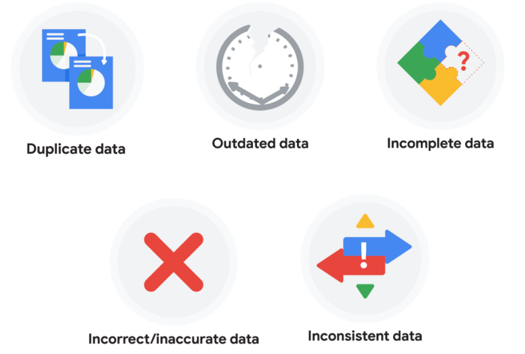

# Dirty data

Dirty data is data that's incomplete (không đầy đủ), incorrect (không đúng), or irrelevant (không liên quan) to the problem you're trying to solve.

Clean data is data that's complete (đầy đủ), correct (đúng), or relevant (liên quan) to the problem you're trying to solve.

No dataset is perfect

A null
- An indication that a value does not exist in a data set.
- Khi bắt đầu clean nghĩ cách xử lý với data null

## Data engineers 
Transform data into a useful format for analysis

Give it a reliable infrastructure (cơ sở hạ tầng). 

Develop, maintain, and test databases and related systems.

## Data warehousing specialists (Chuyên gia)
- Develop processes (quy trình) and procedures (thủ tục) to effectively store and organize data.

## Types of dirty data

| Type | Description | Possible causes | Potential harm to businesses |
| --- | --- | --- | --- |
| Duplicate data | Any data record that shows up more than once | Manual data entry (nhập thủ công)   batch data imports (nhập hàng loạt)   data migration (di chuyển dữ liệu) | Skewed metrics or analyses (chỉ số phân tích bị sai lệnh)   inflated or inaccurate counts or predictions ( số lượng + dự đoán bị tăng cao \ không chính xác )   confusion during data retrieval (gây nhầm lẫn trong quá trình truy xuất)
| Outdated data | Any data that is old which should be replaced with newer and more accurate (chính xác) information | People changing roles or companies (thay đổi người trong tổ chức)   Software and systems becoming obsolete (hệ thống bị lỗi thời) | Inaccurate insights, decision-making, and analytics |
| Incomplete data (Data không đầu đủ) | Any data that is missing important fields | Improper data collection (Thu thập dữ liệu không đúng cách)   Incorrect data entry (Nhập dữ liệu không chính xác) | Decreased productivity (năng suất giảm)   Inaccurate insights (Thông tin chi tiết không chính xác)   Inability to complete essential services (Không có khả năng hoàn thành các dịch vụ thiết yếu) |
Incorrect/inaccurate data (Data sai - nhưng đủ) | Any data that is complete but inaccurate | Human error inserted during data input, fake information, or mock data | Inaccurate insights or decision-making based on bad information resulting in revenue loss |
Inconsistent data (data không nhất quán - nhiều format) | Any data that uses different formats to represent the same thing | Data stored incorrectly or errors inserted during data transfer | Contradictory data points leading to confusion or inability to classify or segment customers |

# Clean data

Compatibility 
- Describes how well two or more datasets are able to work together

## Common data-cleaning pitfalls

### Not checking for spelling errors

Không check lỗi chính tả
- Misspellings can be as simple as typing or input errors.
- Most of the time the wrong spelling or common grammatical errors can be detected, but it gets harder with things like names or addresses. 

- For example:
    1. Working with a spreadsheet table of customer data
    1. Come across a customer named “John” whose name has been input incorrectly as “Jon” in some places. 
    1. The spreadsheet’s spellcheck probably won’t flag this
    1. Don’t double-check for spelling errors and catch this, your analysis will have mistakes in it. 

#### Forgetting to document errors

Không viết tài liệu về lỗi
- Documenting your errors can be a big time saver, as it helps you avoid those errors in the future by showing you how you resolved them. 
- Ghi lại lỗi gặp phải để rút kinh nghiệm cho lần sau
- For example:
    1. you might find an error in a formula in your spreadsheet.
    1. You discover that some of the dates in one of your columns haven’t been formatted correctly. 
    1. If you make a note of this fix, you can reference it the next time your formula is broken, and get a head start on troubleshooting
    1. Documenting your errors also helps you keep track of changes in your work, so that you can backtrack if a fix didn’t work. 

### Not checking for misfielded values

Không kiểm tra các giá trị bị điền sai
- A misfielded value happens when the values are entered into the wrong field. 
    - Giá trị bị điền sai trường xảy ra khi các giá trị được nhập vào sai trường.
- These values might still be formatted correctly, which makes them harder to catch if you aren’t careful. 
    - Những giá trị này có thể vẫn được định dạng chính xác, điều này khiến chúng khó bắt hơn nếu bạn không cẩn thận.

- For example
    1. you might have a dataset with columns for cities and countries
    1. These are the same type of data, so they are easy to mix up
    1. But if you were trying to find all of the instances of Spain in the country column, and Spain had mistakenly been entered into the city column, you would miss key data points
    1. Making sure your data has been entered correctly is key to accurate, complete analysis. 

#### Overlooking missing values

Bỏ qua các giá trị bị thiếu
- Missing values in your dataset can create errors and give you inaccurate conclusions. 
- For example:
    1. if you were trying to get the total number of sales from the last three months, but a week of transactions were missing, your calculations would be inaccurate
    1. As a best practice, try to keep your data as clean as possible by maintaining completeness and consistency.

### Only looking at a subset of the data

Chỉ xem xét một tập hợp con của dữ liệu
- It is important to think about all of the relevant data when you are cleaning. 
- This helps make sure you understand the whole story the data is telling, and that you are paying attention to all possible errors. 

- For example:
    1. If you are working with data about bird migration patterns from different sources, but you only clean one source, you might not realize that some of the data is being repeated
    1. This will cause problems in your analysis later on
    1. If you want to avoid common errors like duplicates, each field of your data requires equal attention.

### Losing track of business objectives

Mất dấu các mục tiêu kinh doanh
- When you are cleaning data, you might make new and interesting discoveries about your dataset
    - Khi bạn đang làm sạch dữ liệu, bạn có thể có những khám phá mới và thú vị về tập dữ liệu của mình
- But you don’t want those discoveries to distract you from the task at hand.
    - Nhưng bạn không muốn những khám phá đó làm bạn xao nhãng khỏi nhiệm vụ trước mắt.

- For example: 
    1. If you were working with weather data to find the average number of rainy days in your city, you might notice some interesting patterns about snowfall, too
    1. That is really interesting, but it isn’t related to the question you are trying to answer right now
    1. Being curious is great! 
    1. But try not to let it distract you from the task at hand.  

### Not fixing the source of the error

Không sửa được nguồn lỗi
- Fixing the error itself is important. 
- But if that error is actually part of a bigger problem, you need to find the source of the issue.
    - Nhưng nếu lỗi đó thực sự là một phần của một vấn đề lớn hơn, bạn cần phải tìm ra nguồn gốc của vấn đề.
- Otherwise, you will have to keep fixing that same error over and over again.
    - Nếu không, bạn sẽ phải tiếp tục sửa lỗi đó lặp đi lặp lại.

- For example: 
    1. Imagine you have a team spreadsheet that tracks everyone’s progress
    1. The table keeps breaking because different people are entering different values
    1. You can keep fixing all of these problems one by one, or you can set up your table to streamline data entry so everyone is on the same page
    1. Addressing the source of the errors in your data will save you a lot of time in the long run. 

### Not analyzing the system prior to data cleaning

Không phân tích hệ thống trước khi làm sạch dữ liệu
- If we want to clean our data and avoid future errors, we need to understand the root cause of your dirty data.
    - Nếu chúng tôi muốn làm sạch dữ liệu của mình và tránh các lỗi trong tương lai, chúng tôi cần phải hiểu nguyên nhân gốc rễ của dữ liệu bẩn của bạn.

- For example: 
    1. Imagine you are an auto mechanic
    1. You would find the cause of the problem before you started fixing the car, right? The same goes for data
    1. First, you figure out where the errors come from
    1. Maybe it is from a data entry error, not setting up a spell check, lack of formats, or from duplicates
    1. Then, once you understand where bad data comes from, you can control it and keep your data clean.

### Not backing up your data prior to data cleaning

Không sao lưu dữ liệu của bạn trước khi làm sạch dữ liệu
- It is always good to be proactive and create your data backup before you start your data clean-up
- If your program crashes, or if your changes cause a problem in your dataset, you can always go back to the saved version and restore it
- The simple procedure of backing up your data can save you hours of work and most importantly, a headache. 

### Not accounting for data cleaning in your deadlines/process

Không tính đến việc làm sạch dữ liệu trong thời hạn / quy trình của bạn
- All good things take time, and that includes data cleaning. 
- It is important to keep that in mind when going through your process and looking at your deadlines. 
- When you set aside time for data cleaning, it helps you get a more accurate estimate for ETAs for stakeholders, and can help you know when to request an adjusted ETA. 

## Clean data on spreadsheet

1. Tìm những columns lỗi nhiều
    - Những columns dễ nhìn ra = mắt thường
1. Dùng `Format`/`Condictional format rules` lọc những lỗi hiến gặp ở những columns không phải phía trên
    - Kiểm tra từng column
    - Không có column nào không có lỗi
1. `Data`/`Remove duplicate` 
1. Đồng nhất format
    - Column về date
    - Column về money

Delimiter: Dấu phân cách
- A character that indicates the beginning or end of a data item
- Such as a comma

Sort 
- Để tìm hiểu logic/format của data

Filter
- Tìm những value đặc biệt

Pivot table
- Bức tranh toàn cảnh về data set
- Dùng pivot table để sort

Sử dụng chart để nhặn sạn bất thường

Data mapping
- the process of matching fields from one database to another. 

Compatibility 
- How well two or more data sets are able to work together.

Schema 
- A way of describing how something is organized.

## Manually cleaning data

Làm sạch dữ liệu theo cách thủ công

