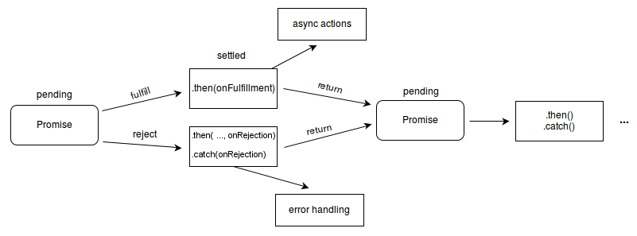

# 1. Programming Language type
## Loosely typing 
không khai báo cụ thể kiểu biến
- javascript
- php
- ruby
- python

### Dynamically typed: 
- Một ngôn ngữ thuộc kiểu dynamically typed là ngôn ngữ có type được nhận biết trong quá trình runtime.
```
var a = 1 // int
var b = 'test' // string
```

### Weakly typed
Một ngôn ngữ thuộc kiểu weakly typed là ngôn ngữ mà type a có thể được suy ra từ một type khác.
```
- 1 + '2' // '12'
```

## Stricti typing
phải khai báo thông tin cụ thể
- Java
- C#

# 2. Datatype
Type trong JS vừa là dynamically và weakly

## Primary 
mỗi lần biến sẽ được khai báo vào được 1 ô nhớ mới
- string
- number
- boolean
- bigint
- symbol

## Reference 
Assign lầu đầu sẽ tạo 1 ô nhớ mới trong bộ nhớ, assign những lần sau sẽ sửa vào ô nhớ đã tạo từ lần đầu
- object
- array
- function
- null
- undefined

# 3. Variable
## Let/const
Let và const thì scope đều là block scope

nếu khai báo trong 1 {block} thì không được dùng bên ngoài {block} đó

Bản chất của const là nó không làm thay đổi được giá trị reference
=> Const không reassigned
```
const a = 1;
a = 2 //Error
```

Const = object = refer tới 1 ô nhớ
- Không refer được tới ô khác
- Vẫn có thể thay đổi giá trị properties của object đó
```
const cool = { 
    people: ['you', 'me', 'tesla', 'musk'] 
}
cool.people.push('berners-lee')
console.log(cool) // { people: ['you', 'me', 'tesla', 'musk', 'berners-lee'] }
```

## Null/Undefind
Undefined có nghĩa là không xác định. 
- Trong javascript, khi bạn khai báo một biến nhưng chưa gán giá trị cho nó
=> giá trị của biến đó sẽ là undefined.

Null có nghĩa là giá trị rỗng hoặc giá trị không tồn tại.

# 4. Falsy and Truthy
    
## falsy -> if sai
- 0
- -0
- false
- null
- undefined
- “" (length = 0)
- NaN

## truthy -> if đúng
- tất cả không phải falsy

# 5. Comparison operator
== là so sánh bằng nhưng có ép type
- không bằng là !=

=== là so sánh bằng nhưng ko ép kiểu
- không bằng là !==

\> là lớn hơn
- \>= là lớn hơn hoặc bằng

< là nhỏ hơn
- <= là nhỏ hơn hoặc bằng

return **boolean**

# 6. Function
function là reference datatype trong js
```
function a() {}
var b = a;
console.log(typeof b); //function
```

khai báo function
- declaction function
```
function foo() {...}
```
- expression function
```
var foo = function() {...}
```
- self-involing function
```
(function() {...})()
```

**this** trong function = context mà nó đc gọi
```
var a = {
    name: "Duy",
    age: 21,
    showInfor: function() {
        console.log(this); // 'this' thay thế  cho a
    }
}
```

- Nếu function đc khai báo cục bộ =auto=> context = Window
```
var a = {
    func: function() {
        function func2() {
            console.log(this); // 'this' thay thế  cho 'Window'
        }
        func2();
    }
}
```

call
```
# Template
    function.call(refer__this, ...arguments);
# Code
    var p1 = {
        name : "Duy"
    }
    function sayHello(company, message) {
        console.log('Hello I\'m ' + this.name + " , " + company + " company. " + message);
    }
    sayHello.call(p1, 'IMPL', 'Nice to meet you!'); //Hello I'm  Duy, IMPL company. Nice to meet you!
```

# 7. Callback
callback là một function truyền vào 1 function khác như 1 argument
- Function kia có thể  gọi callback function bên trong scope của mình
```
function sayHello() {
    console.log('hello world');
}
function demoFunc(callback) {
    callback();
}
demoFunc(sayHello); //hello world
```

# 8. Arrow function
Arrow function dùng để viết tắt
```
var a = function(...arg) {...}
var a = (...arg) => {...}
```
```
var a = function(...arg) {
    return result
}
var a = (...arg) => result
```

Arrow function không có this như function thường => this sẽ là context gần nhất
```
var adder = {
    base: 1,

    add: function(a) {
        var f = v => v + this.base; //context gần nhất là adder
        return f(a);
    }
};
console.log(adder.add(1));
``` 
(!) essential : thiết yếu

# 9. Array
## map
- tạo 1 array mới từ 1 array mà mỗi element là biến đổi của 1 element trong source
```
const array1 = [1, 4, 9, 16];
// pass a function to map
const map1 = array1.map(x => x * 2);
```

## filter
- tạo 1 array mới từ 1 array gồm những elements của source array thỏa mãn điều kiện
```
const words = ['spray', 'limit', 'elite', 'exuberant', 'destruction', 'present'];
const result = words.filter(word => word.length > 6);
```

## reduce
- biến đổi các elements của array để tạo 1 value;
```
const words = ["Lorem", "Ipsum", "is", "simply", "dummy", "text", "of", "the", "printing", "and", "typesetting", "industry"]
const sentence = words.reduce(function(mergeString, word) {
    return mergeString += word;
}, "");
```
**normalization**
```
var users = [
    {
        id: 'a1',
        name: 'Duy',
        age: 24
    },
    {
        id: 'a2',
        name: 'Duy',
        age: 24
    },
    {
        id: 'a3',
        name: 'Duy',
        age: 24
    },
    {
        id: 'a4',
        name: 'Duy',
        age: 24
    }
]

var mergeItem = function(obj, item){
    obj[item.id] = item;
    return obj;
}

// normalization
var usersById = users.reduce(mergeItem, {});

console.log('usersById', usersById);

usersById['a2'].name = "Duy 2";
console.log('user a2', users[1]);
```

## (!) 
map/filter/reduce & forEach, for
- khi thực hiện cùng 1 nhiệm vụ, map/filter/reduce nhanh hơn forEach, for
- forEach, for lặp lại 1 action cho từng element
- map/filter/reduce tạo ra giá trị mới

# 10.Destructuring
unpack values from arrays, or properties from objects
```
var a, b, rest;
[a, b, ...rest] = [10, 20, 30, 40, 50];
/*
    a = 10
    b = 20
    rest = [30, 40, 50]
*/
var person = {name: "Duy", age: 21}; 
var {name, age} = person;
/*
    name = "Duy"
    age = 21
*/
```

# 11.Spread syntax 
gộp các element thành 1 array
```
var a, b, rest;
[a, b, ...rest] = [10, 20, 30, 40, 50];
/*
    rest = [30, 40, 50]
*/
function demo(a, b, ...rest) {...}
demo(10, 20, 30, 40, 50);
/*
    rest = [30, 40, 50]
*/
```
trải elements của 1 array vào 1 array khác
```
var x = [1, 2, 3]
var y = [4, 5, ...x] // [4, 5, 1, 2, 3]
```
trải properties của obj cho 1 obj khác
```
var person = {name: "Duy", age: 21}; 
var student = {...person, job: 'student'} //{name: "Duy", age: 21, job: "student"}
```

# 12. template literal
để string vào backtick : 
```
`string`
```

lưu cả xuống dòng, tab của string trong code
```
var x = `string 1
        string 2`
/*
"string 1
        string 2"
*/
```
truyền biến vào string
```
var x = 'world'
var hello = `hello ${x}` //hello world
```

# 13. Closure
**(!)** Sẽ có câu hỏi khi review

## scope
global
- defind bên ngòai document

function
- Mỗi lần call function => tạo mới 1 scope của function
- => mỗi lần call = 1 lần tạo mới local var
    - local var chỉ được sử dụng trong scope của function
- khi function finished the execution 
    - khi return
    - destroy scope
        - garbage colleciton = auto xóa bởi máy ảo (giống java)
- inner
- child function

## closure
là 1 (nested) child function refer tới var của parent function
- Khi scope của parent func xóa 
- => var đc closure refer của parent func sẽ ko bị garbage collected

## Builder Pattern
```
function buildAdder(x) {
    var accumlator = x;

    return function(y) {
        return accumlator += y;
    }
}

var adder = buildAdder(1);
adder(2);   //  3
adder(3);   //  6
adder(4);   //  10
```

## Stimulate Class
```
var newPerson = function(name) {
    var _name = name;
    return {
        setName: function(name) {
            _name = name;
        },
        getName: function() {
            return _name;
        },
        sayHi: function() {
            console.log('Hi, I\'m ' + _name);
        }
    }
}

var person1 = newPerson('Person 1');
person1.sayHi();

var person2 = newPerson('Person 2');
person2.sayHi();
```

## Singleton Partern
```
const singleton = (function() {
    var _incrementor = 0;
    return {
        get: function() {
            return "Incrementor = " + _incrementor;
        },
        increment: function() {
            _incrementor++;
        }
    };
}());
console.log(singleton.get());
singleton.increment();
console.log(singleton.get());
```

##  Pitfall Closure
```
var newPerson = function(name) {
    var _name = name;
    var methods = {
        getName() {                 //mỗi lần gọi newPerson() lại khởi tạo function 
            return _name;           //tốn bộ nhớ
        },
        setName(name) {
            _name = name;
        },
        sayHello() {
            console.log('Hello, I\'m ' + _name);
        }
    }

    return methods
}
```

# 14. Prototype
## Class
trong js không có Class
- stimulate (phô phỏng) class
- When function <=created= JS engine add Prototype to it
    - Prototype has
        - Prototype của object
        - constructor function
```
var Human = function(name) {
    this.name = name;
}

Human.prototype.sayHello = function() {
    console.log("Hello, I'm " + this.name);
}

Human.prototype.goRage = function() {
    console.log("goRage");
}

var p1 = new Human('p1');   // new =call=> Prototype.constructor()
                            // add __proto__ =refer=> function.prototype
                            // không mất công tạo những gì có trong prototype
var p2 = new Human('p2');

p1.sayHello();
p2.sayHello();
p1.goRage();

console.log(p1.hasOwnProperty('name'));
console.log(p1.hasOwnProperty('goRage'));
console.log(p1.hasOwnProperty('hasOwnProperty'));

console.log(Object.getPrototypeOf(p1));
console.log(p1);
```

## Inheritance
```
var SuperHero = function(name, alias, power) {
    Human.call(this, name);
    this.alias = alias;
    this.power = power;
}

SuperHero.prototype = Object.create(Human.prototype);
SuperHero.prototype.constructor = SuperHero;

var s1 = new SuperHero('p1', 'a1', 'pow1');
console.log(s1 instanceof SuperHero);
console.log(s1 instanceof Human);
s1.sayHello();
```

## Polymorphism
```
SuperHero.prototype.sayHello = function() {
    console.log("Hello, I'm " + this.alias);
}
- Khi gọi 1 attribute trong prototype
engine =find=> this.__proto__ =dont_has=> super.__proto__ =dont_has=> Object.__proto__
```

# 15. Object
getPrototypeOf
```
# Template
    Object.getPrototypeOf(obj) // get Prototype of obj
```
create
- Clone value của object sang 1 object mới
- object mới không reference tới object cũ
```
# Template
    var obj2 = Object.create(obj) // return clone of original obj
```
hasOwnProperty
```
# Template 
    obj.hasOwnProperty('nameOfProperty) // return boolean
```

# 16. Promise
`Promise` là 1 object bao gồm trạng thái cuối cùng (có thể là lỗi) của một method không đồng bộ và kết quả của method đó.
- `Promise` là proxy for a value không cần biết khi khởi tạo, liên kết các quá trình sử lý không đồng nhất để trả về success value or failure reason. 
- This lets asynchronous methods return values like synchronous methods.
    - Instead of immediately returning the final value, the asynchronous method returns a `Promise` to supply the value at some point in the future.
- `Callback` là một đoạn mã thực thi đại diện cho một asynchronous method được truyền như một paramester vào một method sẽ được thực hiện để có thể gọi lại call asynchronous method back. Quá trình này kéo dài tới khi asynchronous method dừng.

Constructor của Promise dùng để wrap method chưa hỗ trợ promise.
```
new Promise( function executor (resolve, reject) {...} );
```
- Function truyền vào Promise là executor. Function này được executed trước cả Promise constructor.
- The executor normally initiates some asynchronous work for main function, and then, once that completes, it will call resolve or reject.
- `resolve` và `reject` là các function sẽ được gọi tương ứng với trạng thái của main function.
    - `resolve` resolve the promise when main function run successfully.
    - `reject` returning value if error occurred. If an error is thrown in the executor function, the promise is rejected. The return value of the executor is ignored.

Promise có 3 states
- *pending*: initial state, neither fulfilled nor rejected.
- *fulfilled*: meaning that the operation completed successfully.
- *rejected*: meaning that the operation failed.


## `Promise.then`
The `then()` method returns a `Promise`. 
- It takes up to two arguments: callback functions for the success and failure cases of the `Promise`.
```
p.then(
  (value) => {
    // sử lý value nếu success
  }, 
  (error) => {
    //sử lý error
  }
);
```
- Nếu chỉ truyền vào then() 1 function đó tự động là fullfill function, function này chỉ chạy khi Promise is fulfilled.
- Một khi Promise được xử lý xong(success hoặc error), nó sẽ gọi hàm sử lý (onFulfilled  or onRejected) dưới dạng asynchronous (scheduled in the current thread loop).

Khi handle function : 
- <ins>returns a value</ins>, the `Promise` returned by `then()` gets resolved with the returned value as its value;
- <ins>doesn't return anything</ins>, the `Promise` returned by `then()` gets resolved with an `undefined`value;
- <ins>throws an error</ins>, the `Promise` returned by `then()` gets rejected with the thrown error as its value;
- <ins>returns an already resolved `Promise`</ins>, the `Promise` returned by `then()` gets resolved with that promise's value as its value;
- <ins>returns an already rejected `Promise`</ins>, the `Promise` returned by `then()` gets rejected with that promise's value as its value;
- <ins>returns another pending `Promise` object</ins>, the resolution/rejection of the `Promise` returned by `then()` sẽ truyền cho `Promise` returned by handler. Also, the value of the `Promise` returned by `then()` will be the same as the value of the `Promise` returned by the handler.

## `Promise.catch`
The `catch()` method returns a `Promise` and deals with rejected cases only.
```
mainFunction.catch(function(error) {
  //Sử lý error
})

mainFunction.catch(function(error) { ... }) 
//tương đương với
mainFunction.then(undifine, function(error) { ... })
```

## Promise.finally
The `finally()` method returns a Promise. When the promise is settled, i.e either fulfilled or rejected, the specified callback function is executed. This provides a way for code to be run whether the promise was fulfilled successfully or rejected once the Promise has been dealt with.
