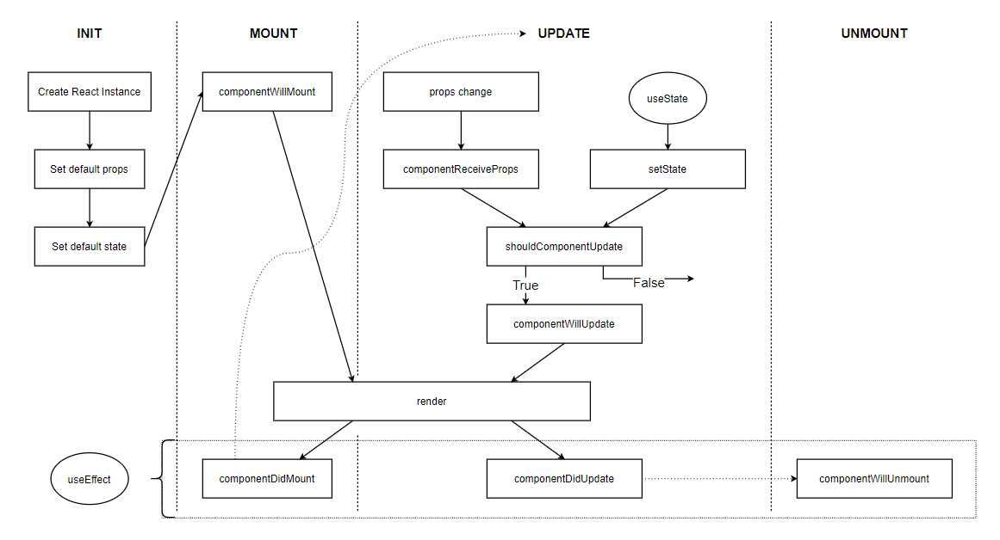

| Hook      | Lifecycle |
| ----------- | ----------- |
| useReducer -> useState | setState   default.state   this.state |
| useEffect | componentDidMount   componentDidUpdate   componentWillUnmount |
| useMemo | shouldComponentUpdate -> false |

createContext
- tạo Component chứa global state
- `useContext` để child component lấy state từ Context Component

`useRef`
- tạo ra 1 variable nằm ngoài lifecycle
- khi update không làm re-render
