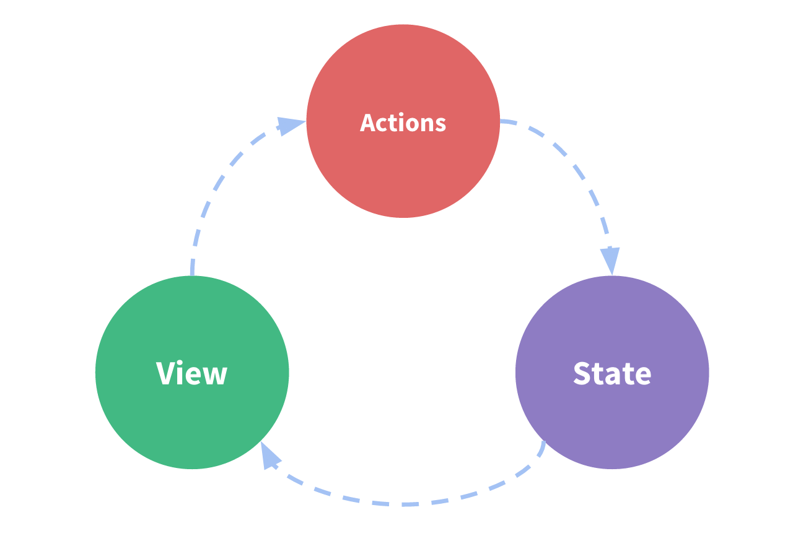

# Attribute
## data
Function trả về variable của component


Methods có thể dùng variable bằng cách thông qua this
```... this.tên_variable ...```

## methods
Object chứa các methods của component
- Method có thể call ở bất kì function nào trong component
- Method để xử lý event

## computed
Method return value dùng để thay thế data
- Dành cho những biến hay thay đổi trong component
```

computed: {
  show: { //tên object
    get() { //khi 1 thằng nào đó lấy value của show, nó sẽ lấy returned value từ get()
      //process
      return value
    }
    set(newValue) {//khi 1 thằng gán value cho show : show = newValue, newValue sẽ truyền vào set
      //process
    }
  }
}
```

## watched
Quan sát sự thay đổi của 1 data

## mixin
Ghép các tính chất của 1 component vào component khác
```

import mixin1 from ...
import mixin2 from ...

export default {
  mixins: [
    mixin1,
    mixin2
  ]
}
//component có thể dùng mọi thứ trong mixin như là của riêng component
```

## props
Data nhận từ parent component.

không được gán giá trị vào `props`

Khai báo không quan tâm data type
```
props: ['data1', 'data2',...]
```

Khai báo quan tâm data type
```
props: {
  prop_name: prop_type,
  title: String,
  likes: Number,
  isPublished: Boolean,
  commentIds: Array,
  author: Object
}
```

Khai báo có default value
```
props: {
  props_name: {
    type: data_type,
    default: default_value
  }
}
```

Khai báo prop như 1 attribute của component
```
//trong child component
props: {
  open: {
    type: Boolean, //Boolean dùng tốt nhất
    default: false, //để false để tắt khi không khai báo
    required: true // để true để thay đổi value = default:false sang true
  }
}

//trong parent component
<child-component open></child-component> //chỉ cầng gọi lên thì open == true
```

# Lifecycle


1. beforeCreate : trước khi load data và init events của Vue.

1. created : sau khi khởi tạo Vue xong, trước khi compile template.

1. beforeMount : trước khi dịch từ template của Vue sang code HTML, CSS, JS

1. mounted : sau khi dịch template của Vue, sau khi quét thay đổi của data.

1. beforeUpdate : trước khi thay đổi template.

1. updated : ngay sau khi thay đổi template.

1. beforeDestroy : trước khi tắt toàn bộ các thành phần của Vue.

1. destroyed : sau khi đã tắt hết thành phần, chuẩn bị thoát.

# Event
Truyền data từ child component to parent component thì sử dụng hàm $emit
- Tạo event để truyền data từ child component ra ngoài
```
# Child component
export default : {
  methods: {
    tên_method (paramester) {
      ...
      this.$emit('tên_event', value_output)
      ...
    }
  }
  ...
}

# Parent component
<template> 
  <child-component @tên_event="tên_var = $event"> </child-component>
  ...
</template>
```

Tạo v-model
```
# Child
export default : {
    props: {
        value: Datatype //bắt buộc phải có props 'value'
    },
    methods: {
        methodA() {
            this.$emit('input', value) //bắt buộc phải có event 'input'
        }
    }
}

# Parent 
<template> 
  <child-component @v-model="data"> </child-component>
  ...
</template>
```

# Router
Định tuyến cho component trong App.vue.

The default mode for vue-router is hash mode 
- it uses the URL hash to simulate a full URL so that the page won't be reloaded when the URL changes.
- Khi thay đổi URL => chỉ thay đổi component với `<router-view/>` => không reload trang

1. Tạo routes.js chứa định tuyến
```
// Define routes to component
import Home from './components/Home.vue'
import User from './components/user/User.vue'
export const routes = [
    { path: '/', name: 'homepage', component: Home },
    { path: '/user', name: 'user', component: User }
]
```

1. Import vue-router trong main.js :
```

import VueRouter from 'vue-router'
import { routes } from './routes'

Vue.use(VueRouter)
const router = new VueRouter({
  routes //truyền routes đã tạo VueRouter
})

new Vue({
  el: '#app',
  router, //sử dụng router trong Vue
  render: h => h(App)
})
```

1. Gọi `<router-view/>` trong App.vue
```
<template>
  <div id="app">
    <div class="col-xs-12 col-sm-8 offset-sm-2 col-md-6 offset-md-3 text-left">
      <h1>Vue Router</h1>
      <hr>
      <router-view/>
    </div>
  </div>
</template>
```

## `<router-link>`
thay thế cho tag để điều hướng Router.
```
<a href="..." class="class"> Content </a>
//Thay thế bằng
<router-link tag="a" class="class" to="path_đã_tạo"> Component </router-link>
```
- Thêm active-class cho `<router-link>`
```
<router-link
    class="nav-item"
    tag="li"
    to="/user"
    active-class="active"
>
    <a class="nav-link"> User </a>
</router-link>
```
- Tạo một method thay thế `<router-link>`
```

<template>
    <div>
        <h1>User</h1>
        <button class="btn btn-danger" @click="backHome"> Back to Home</button>
    </div>
</template>
<script>
export default {
    methods: {
        backHome() {
            this.$router.push('/')// = <router-link to="/">, gọi bằng path
            this.$router.push({ name: 'homepage' }) //Gọi = tên
        }
    }
}
</script>
```

## Truyền argument vào `path`
```

// routes.js
export const routes = [
   ...
    { path: '/user/:id', name: 'admin', component: UserDetail }, //truyền id vào
    { path: ':id/edit', name: 'useredits', component: UserEdit }
]

//trong component UserDetail và cả UserEdit (chỉ cần trong link có truyền vào id thì thằng nào cũng lấy được.
export default {
    methods: {
        ...
        goDetails() {
            this.$router.push('/user/abc')//gọi kèm theo argument
            this.$router.push({ name: 'userdetails', params: {id: 'abc'} })//gọi kèm theo argument
        }
    }
}
```

Lấy parameters từ route
```
data () {
    return {
        id : this.$route.params.id //lấy parameters của $route
    }
},
```

## Child Router
Tạo child path trong routes.js
```
export const routes = [
    { path: '/', name: 'homepage', component: Home },
    { path: '/user', name: 'user', component: User, children: [
        { path: '', name: 'index', component: UserStart },
        { path: ':id', name: 'userdetails', component: UserDetail },
        { path: ':id/edit', name: 'userdetails', component: UserEdit },
    ]},
]
```

Gọi child component với `<route-view>`
```
//parent component
<template>
    <div class="mt-3">
        <h1 class="text-center">User</h1>
        <button class="btn btn-success text-center btn-block" @click="backHome"> Back to Home </button>
        <router-view/>
    </div>
</template>

//trong component UserStart ở example trên 
<ul class="list-group">
    <router-link
        tag="li"
        v-for="user in users"
        :key="user.id"
        :to="'/user/' + user.id"
        class="list-group-item"
        style="cursor: pointer"
    >User id : {{ user.id }}</router-link>
</ul>
//=> khi click vào bất kì route-link nào thì child component sẽ thay thế route-view trong parent component
```

## Redirect
```
{ path: '/auth-redirect', redirect: { name: 'homepage' } }
```

Khi nhập sai link sẽ chuyển qua error component
```
{ path: '*', redirect: { name: 'errorage' } } // * đại diện cho tất cả các path chưa được khai báo
```

# Vuex
Vuex = state management pattern + library
- Lưu trữ variables chung cho cả project => tất cả các components đều có thể dùng variables đó.

## State
```
//Cấu trúc của 1 Vue
new Vue({
  // view
  template: `
    <div>{{ count }}</div>
  `,
  // state
  data () {
    return {
      count: 0
    }
  },
  // actions
  methods: {
    increment () {
      this.count++
    }
  }
})
```

The state
- The source of truth that drives our app.
- Đó là biến thực sự của app

The view
- Which is just a declarative mapping of the state.
- Result của state.get()

The actions
- The possible ways the state could change in reaction to user inputs from the view.
- Các function → state.set()



Vuex là quản lý những state dùng chung.
- Tạo 1 state
```
//trong store.ts
export default new Vuex.Store({
  state: {
    result: 0 //tạo 1 status chung cho toàn project với default value
  }
})

//có thể get/set trực tiếp state ở bất kì component nào
<script>
export default {
  methods: {
    increament () {
      this.$store.state.result++
    },
    decreament () {
      this.$store.state.result--
    }
  }
}
</script>
``` 
- Khi một component thay đổi 1 state thì các components khác dùng state đó cũng thay đổi.

## Getters
Là những function chuyên để return value từ `vuex` sau khi process.
- Paramester thường là `state` để sử lý data chung của project.
```
//trong store.ts
export default new Vuex.Store({
  state: {
    result: 0
  },
  getters: {
    tenResult: state => {
      return state.result * 10
    }
  }
})

//trong component
tenResult () {
  return this.$store.getters.tenResult
}
```

mapGetters
- Để giảm thiểu code và component dùng trực tiếp các getters thì dùng qua `mapGetters`
- `mapGetters` là một hàm của `Vuex` → lấy các getter của `store.js`
```
//trong component
<template>
    <div>
      <!-- <p>This is the results : {{ result }}</p> -->
      <p>This is the results : {{ getResult }}</p>
      <br>
      <p>There is ten times of results : {{ tenResult }}</p>
    </div>
</template>

//case 1
<script>
import { mapGetters } from 'vuex'
export default {
  computed: {
    ...mapGetters([ //lấy toàn bộ thuộc tính của getters
      'getResult', //các getter sẽ được lấy
      'tenResult'
    ])
  }
  
}
</script>
```

## Mutation
Là những functions sử lý thay đổi state
```
mutations: {
  name_func(
    state, //luôn bắt đầu 1 mutation = state
    payload) 
  {
    ...sửa lý thay đổi các biến trong state dựa theo payload
  }
}
```

Commit
- Là function để component gọi 1 mutation
```

//trong store.ts
export default new Vuex.Store({
  mutations: {
    increamentOp (state, n) { //tăng theo một số n nào đó
      state.result += n
    }
  },
})

//trong component
<script>
export default {
  methods: {
    increament () {
      //gọi mutation thông qua commit, truyền giá trị của n vào.
      this.$store.commit(
        'increamentOp', //tên của mutation 
        30              //payload
      ) 
    }
  }
}
</script>
```
- Dùng trực tiếp mutations qua mapMutations

## Acitions
Giống mutation nhưng có thể chạy acsynchronous
