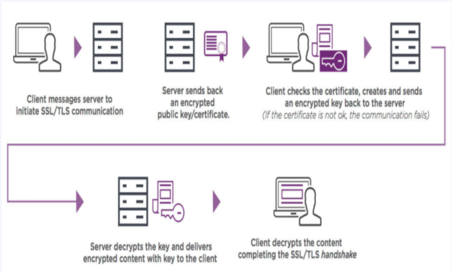

# Web Protocols
Protocol là 1 set của rules được computer sử dụng.

## HTTP
HTTP stands for HyperText Transfer Protocol

HTTP Request, Response communication between clients and servers
1. A client (a browser) sends an HTTP request to the web
1. A web server receives the request
1. The server runs an application to process the request
1. The server returns an HTTP response (output) to the browser
1. The client (the browser) receives the response

### XHR
XMLHTTPRequest
1. Browser: An event occurs
1. create XHR object
1. send Http Request
1. send Request via Internet
1. Server: receive Http Request
1. process Http Request
1. create Response
1. send Response via Internet
1. Browser: receive Http Response
1. Process returned data using JS, update page content

HTTP uses TCP, generally over port 80

### HTTPS
HTTPS stands for Hypertext Transfer Protocol Secure
- also referred to as HTTP over TLS or HTTP over SSL.

HTTPS uses TCP, port 443
- within a connection encrypted by TLS.

The main purpose of using HTTPS is for security and privacy reasons.
- HTTP operates at the application layer
- while HTTPS operates at the transport layer.

HTTPS it is required that you have an SSL certificate
- it is signed by a CA (Certificate Authority)
- With HTTPS the data is encrypted before sending.

HTTPS is a secure form of the HTTP protocol. 
- It wraps an encrypted layer around HTTP, Transport Layer Security (TLS). 
- Clients and servers communicate using HTTP it is now secure because of the TLS wrapper.

## FTP (file transfer protocol)
Là giao thức mạng chuẩn để truyền file từ 1 host sang các host khác thông qua mạng dựa trên TCP, như Internet

FTP có thể dùng để upload và download file từ phía người dùng
- port 21 is for client connecting to servers 
- port 20 is for servers connecting to clients
- Control traffic is exchanged over TCP/21 (only control information)
- data transmission is performed over TCP/20.

# Web storage

## Cookies
Cookie là một đoạn văn bản mà một Web server có thể lưu trên ổ cứng của client. 

Cookie cho phép một website lưu các thông tin trên máy tính của người dùng và sau đó lấy lại nó. 

Các mẩu thông tin sẽ được lưu dưới dạng cặp tên – giá trị (name-value).

cookie được truyền qua lại giữa client và server qua header của request + response

Session cookie
- chỉ tồn tại trong bộ nhớ tạm thời khi người dùng web

Persistent cookie
-  sẽ hết hiệu lực sau một thời điểm nào đó

Secure cookie
- chỉ được sử dụng thông qua HTTPS

# Security

## SSL (secure socket layer)

1. client yêu cầu kết nối TLS / khởi tạo SSL tới server
1. server response `encrypted public key` & `certificate`
1. client dùng thuật toán để check certificate hợp lệ
1. client gửi trả `encrypted public key` server
1. server decrypted `encrypted public key` để check
1. server response `encrypted content`
1. client receive `encrypted content` và hoàn thiện kết nối SSL/TLS handshake

## SSH (secure shell)
a remote administration protocol 
- Cho phép client điều khiển server thông qua internet

## CORS
Cross-origin resource sharing
- Tài nguyên của 1 web lấy từ nhiều domain khác nhau

thêm `access-control-allow-origin` vào request header

bỏ check CORS trong config của backend

## CSRF
Cross-site Request Forgery
- Tấn công server = request giả mạo lên máy chủ

Khi người dùng vào web => cấp 1 cookie chứa session để định danh user
- Nếu Cookie vẫn sống sau khi user hết phiên sử dụng => có thể dụng nó để tạo request giả mạo

Tạo CSRF_token
- Tạo mới mỗi phiên làm việc của user
- Mỗi request sẽ đính kèm CSRF_token để server check có đúng user không

## JWT
JSON Web Token
- authenticate token có chứa cả data của user

3 phần:
- Header: chứa kiểu dữ liệu , và thuật toán sử dụng để mã hóa ra chuỗi JWT
- Payload: data sẽ chứa trong token dưới dạng json
- Signature: (Mã hóa của header & payload) + khóa bí mật

Ưu điểm:
- Lấy data quan trọng, hay sử dụng = token thay vì phải gửi request
- Dùng để xác thực cho bên thứ 3 vì có thêm data trong token nên có thể query dựa vào data đó

## Oauth2
Authenticate token lấy từ 1 bên thứ 3 (Facebook, Google, ...)

access_token: token dùng để check mỗi request trong phiên làm việc
- khi hết phiên thì access_token cũng hết hiệu lực
refresh_token: token để yêu cầu cấp lại access_token cho phiên tiếp theo mà không phải đăng nhập lại

1. Web đăng kí ủy quyền với bên thứ 3
1. User đăng nhập thông qua ủy quyền của bên thứ 3
1. Bên thứ 3 gửi về token của user
1. User chuyển tiếp token đó cho server
1. Server sẽ gửi access_token cho bên thứ 3 check
1. Bên thứ 3 response về server => server response về user

# HTTP status codes
Informational responses (100–199)

Successful responses (200–299)
- 200 OK: The request has succeeded. The meaning of the success depends on the HTTP method
- 201 Created: The request has succeeded and a new resource has been created as a result. This is typically the response sent after POST requests, or some PUT requests.
- 204 No Content: There is no content to send for this request, but the headers may be useful. The user-agent may update its cached headers for this resource with the new ones.

Redirects (300–399)

Client errors (400–499)
- 400 Bad Request: The server could not understand the request due to invalid syntax.
- 401 Unauthorized" Although the HTTP standard specifies "unauthorized", semantically this response means "unauthenticated". That is, the client must authenticate itself to get the requested response.
- 403 Forbidden: The client does not have access rights to the content; that is, it is unauthorized, so the server is refusing to give the requested resource. Unlike 401, the client's identity is known to the server.
- 404 Not Found: The server can not find the requested resource. In the browser, this means the URL is not recognized. In an API, this can also mean that the endpoint is valid but the resource itself does not exist. Servers may also send this response instead of 403 to hide the existence of a resource from an unauthorized client. This response code is probably the most famous one due to its frequent occurrence on the web.

Server errors (500–599)
- 500 Internal Server Error: The server has encountered a situation it doesn't know how to handle.

# HTTP request methods

## GET
GET is used to request data from a specified resource.
- Note that the query string (name/value pairs) is sent in the URL of a GET request

## POST
POST is used to send data to a server to create/update a resource.
- The data sent to the server with POST is stored in the request body of the HTTP request

## PUT
PUT is used to send data to a server to create/update a resource.

## HEAD

## DELETE
The DELETE method deletes the specified resource.

## PATCH

## OPTIONS

